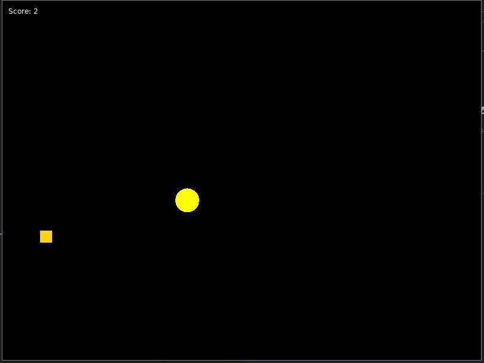

# Coin Collector

This is a simple game built using the LÖVE 2D game framework where the player controls a character (represented by a circle) to collect coins scattered on the screen. The objective of the game is to collect as many coins as possible.

## Game Mechanics

- **Character Movement:** The player controls a character, referred to as "Doge," that can move in all directions using the arrow keys.
- **Coin Collection:** Coins randomly appear on the screen, and the player must move Doge to collect them.
- **Scoring:** The player earns points by collecting coins. The score is displayed in the top left corner of the screen.

- **Left Arrow Key:** Move Doge left.
- **Right Arrow Key:** Move Doge right.
- **Up Arrow Key:** Move Doge up.
- **Down Arrow Key:** Move Doge down.

## How to run
- make sure you installed Love2D
- download the repo files
- open the main.lua file with an editor
- run the main.lua file

